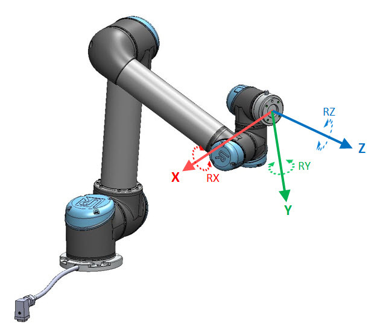
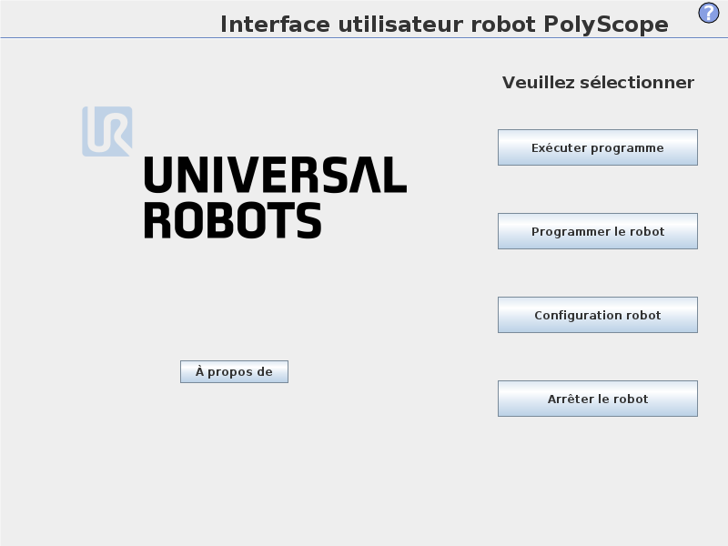
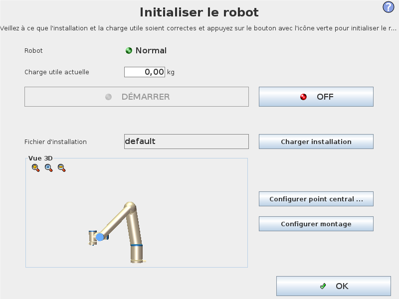
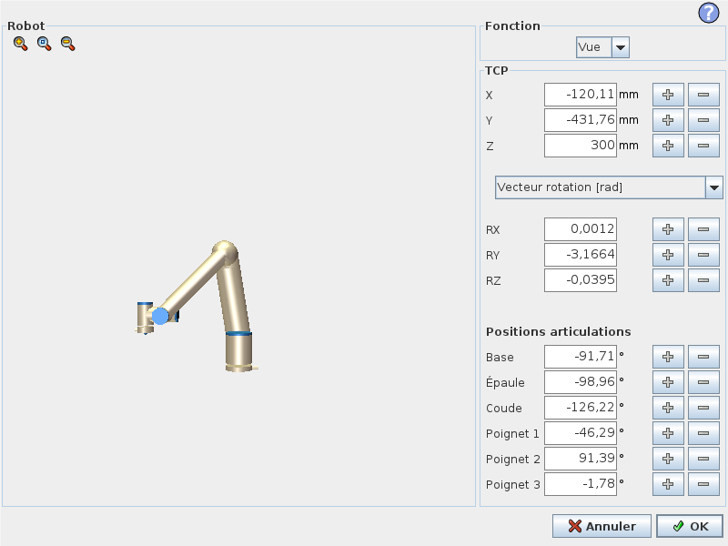
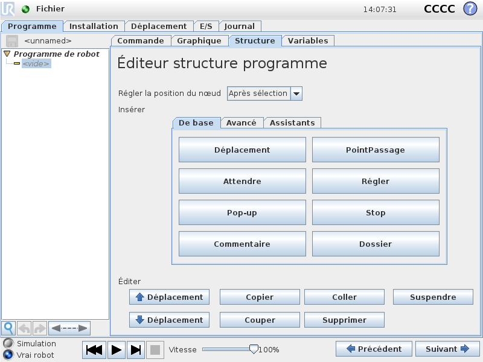

# Présentation 
UR5 est un robot à six (6) degré de liberté. Il est constitué des parties suivantes : 
Base, Epaule, Coude, poignet 1, Poignet 2 et Poignet 3.
UR5 est un robot collaboratif avec une charge utile de 5 kg



## Interface de programmation Polyscope


- Exécuter programme : Permet de choisir et exécuter un programme existant.
- Programmer le robot : Modifier un programme ou créer un nouveau programme.
- Configuration robot : Changer la langue, régler les mots de passe, mettre à jour le logiciel, etc
- Arrêter le robot : Met le bras du robot hors tension et arrête le boitier contrôleur

Ecran d’initialisation :



Ecran éditeur Pose



Les cases textuelles affichent les valeurs complètes des coordonnées de ce TCP (Tool Centre Point) par rapport à la fonction sélectionnée. X, Y et Z représentent la position de l’outil, tandis que RX, RY et RZ contrôlent l’orientation de l’outil.


Les Différents type de représentation d’orientation de l’outil sont :
- Le vecteur de rotation [rad] : L’orientation est donnée en vecteur de rotation. La longueur de l’axe est l’angle de pivotement en radians, et le vecteur lui-même donne l’axe autour duquel il faut pivoter.
  
- Vecteur de rotation [°] : L’orientation est donnée en vecteur de rotation, ou la longueur du vecteur est l’angle à tourner en degrés.
  - RPY [rad] : Angles Roll, pitch et yaw (RPY), ou les angles sont en radians. La matrice de rotation RPY (rotation X, Y’, Z”) est donnée par :
  - Angles RPY [°] Roll, pitch et yaw (RPY), où les angles sont en degrés

Un nouveau programme de robot peut démarrer soit à partir d’un modèle soit à partir d’un programme de robot existant (enregistré).


L’onglet Programme montre le programme actuel en cours d’édition.



Types de déplacement
Il existe trois types de déplacement :
- DéplacementA (MoveJ) : effectue des déplacements calculés dans l’espace d’articulation du bras du robot. Chaque articulation est contrôlée afin d’atteindre l’emplacement final désiré en même temps. Ce type de déplacement a pour résultat que l’outil suit une trajectoire courbe. Les paramètres partagés qui s’appliquent à ce type de déplacement sont la vitesse d’articulation et l’accélération d’articulation maximales à utiliser pour les calculs du déplacement, spécifiées respectivement en deg/s et deg/s2. Si l’on souhaite que le bras du robot se déplace rapidement entre les points de passage, en ne tenant pas compte de la trajectoire de l’outil entre ces points, ce type de déplacement est le choix préféré.

- DéplacementL (MoveL) : fait d´déplacer l’outil linéairement entre les points de passage. Cela signifie que chaque articulation effectue un mouvement plus compliqué afin de maintenir l’outil sur une trajectoire en ligne droite. Les paramètres partagés qui peuvent être réglé pour ce type de déplacement sont la vitesse d’outil et l’accélération d’outil désirées, spécifiées respectivement en mm/s et mm/s2, ainsi qu’une fonction. La fonction s´sélectionnée déterminera dans quel espace de fonction sont représentées les positions de l’outil sur les points de passage. Concernant les espaces de fonction, les fonctions variables et les points de passage variables présentent un intérêt particulier. Les fonctions variables peuvent être utilisées lorsqu’il est nécessaire de déterminer la position de l’outil sur un point de passage par la valeur actuelle de la fonction variable lorsque le programme du robot est exécuté.


- DéplacementP (MoveP) : déplace l’outil linéairement à vitesse constante avec lissages Circulaires, déplacement prévu pour certaines opérations de processus 

Application1 :
Matériel : UR5 et une Boite.
A l’aide de « fonctions » définir un repère « R_boite ». (Suivre le processus de définition de repère) 
Faire un programme UR « TP_2024 » permettant au robot de parcourir les coins de la boite. 
Déplacer la boite mais restant toujours sur le plan de travail.
Déduire le programme pour faire parcourir les mêmes coins de la boite  


Transformation Homogène
Rappel 


Application :

Soit :
bTw la transformation du World dans le repère base du Robot
bTf est la transformation du Flange dans le repère base Robot
fTg est la transformation du Tool(gripper) dans le repère Fange
gTc est la transformation de la Caméra dans le repère Tool
cTw  est la transformation du World dans le repère Camera

Détermination de bTw
Soit un R1 une base associée à la mire de calibration. Soit R0, le repère associé au robot.  

1.	Définir trois points A, B et tels que ABC soit un trièdre rectangle direct (AB, AC, AB^AC) soit une base directe.
2.	 Trouver la matrice de transformation entre le repère R1 ((AB, AC, AB^AC)) et le repère R0 du robot. En déduire la transformation homogène T01 entre R0 et R1.


Comment utiliser les informations de la caméra pour amener le Tool vers un point spécifique ?
Déterminer le gTc la transformation de la Caméra dans le repère Tool 
Sachant :

```
bTw  = gTf* fTb* bTw
bTw  = gTc* cTw
gTc  = gTf* fTb* bTw*inv(cTw)
```

Déduire la transformation qui permet de d’exprimer tout point du repère camera dans le repère base du robot 


# Détection reconnaissance et localisation d'objet 


## [Détection](https://www.aranacorp.com/fr/reconnaissance-de-forme-et-de-couleur-avec-python/amp/)

Soit une classe python ``class Detector`` avec les fonctions:
-  ``jaune``:image
-  ``vert``:image
-  ``rouge``:image
-  ``bleu``: image
-  ``couleur``: image
-  ``contours`` : image
-  ``forme_simple`` : contours
-  ``forme_complexe`` : contours
-  ``centre``: contours
-  ``orientation``: contours
-  ``positionXYZ``: centre

Cette permettra de détecter, reconnaitre et localiser un objet
## [Detection de couleur](https://medium.com/@gowtham180502/how-to-detect-colors-using-opencv-python-98aa0241e713) 

 les limites: 
- Rouge:
  - H -> ?
  - S -> ?
  - V -> ?
 
- Jaunes:

  - H ->?
  - S -> ?
  - V ->?

- Vert:
  - H -> ?
  - S -> ?
  - V -> ?

### Exemple de detection du bleu


``` python

# read image
bgr_img = cv2.imread("image.png")
# Convert HSV
hsv_img = cv2.cvtColor(bgr_img, cv2.COLOR_BGR2HSV)

# Lower and higher HSV value for red color
def blue_hsv():
    # H -> 110-130
    # S -> 50-255
    # V -> 50-255
    
    # define range of blue color in HSV
    lower_hsv = np.array([110, 50, 50])
    higher_hsv = np.array([130, 255, 255])
    
    # generating mask for green color
    mask = cv2.inRange(hsv_img, lower_hsv, higher_hsv)
    return mask


mask = blue_hsv()

detected_img = cv2.bitwise_and(bgr_img, bgr_img, mask= mask)
cv2.imshow("detected image", detected_img)
cv2.waitKey(0)

```

1. Ecrire les fonctions du mask du rouge, du jaune, du vert et du jaune 
2. A Partir de l'image `` écrire programme pour classer les figures en fonction de leur couleur``

## Detection de formes: 
## Centre : 


### Exemple de la camera realsense

``` python
import cv2
import numpy as np
#cap = cv.VideoCapture(0,cv2.CAP_DSHOW)
cap = cv2.VideoCapture(0)

while(1):

    # Take each frame
    _, frame = cap.read()

    # Convert BGR to HSV
    hsv = cv2.cvtColor(frame, cv2.COLOR_BGR2HSV)

    # define range of blue color in HSV
    lower_blue = np.array([110,50,50])
    upper_blue = np.array([130,255,255])

    # Threshold the HSV image to get only blue colors
    mask = cv2.inRange(hsv, lower_blue, upper_blue)

    # Bitwise-AND mask and original image
    res = cv2.bitwise_and(frame,frame, mask= mask)

    cv2.imshow('frame',frame)
    cv2.imshow('mask',mask)
    cv2.imshow('res',res)
    k = cv2.waitKey(5) & 0xFF
    if k == 27:
        break

cv2.destroyAllWindows()
```

On prendre une camera sur le robot. utliser cette camera pour reconnaitre 
et classer les pieces en fonction de leur couleur


## Estimation de Pose par realsense

``` python
# packages
import pyrealsense2 as rs
import numpy as np

"""
Utilisation de la camera intel realsense
"""
def initialize_device():
    # Create a pipeline
    pipeline = rs.pipeline()
    config = rs.config()

    pipeline_wrapper = rs.pipeline_wrapper(pipeline)
    pipeline_profile = config.resolve(pipeline_wrapper)
    device = pipeline_profile.get_device()


    config.enable_stream(rs.stream.depth, 640, 480, rs.format.z16, 30)
    config.enable_stream(rs.stream.color, 640, 480, rs.format.bgr8, 30)

    # Start streaming
    profile = pipeline.start(config)

    # Get stream profile and camera intrinsics
    color_profile = rs.video_stream_profile(profile.get_stream(rs.stream.color))
    color_intrinsics = color_profile.get_intrinsics()
    color_extrinsics = color_profile.get_extrinsics_to(color_profile)
   
    # Getting the depth sensor's depth scale (see rs-align example for explanation)
    depth_sensor = profile.get_device().first_depth_sensor()
    depth_scale = depth_sensor.get_depth_scale()

    # Create an align object
    # rs.align allows us to perform alignment of depth frames to others frames
    # The "align_to" is the stream type to which we plan to align depth frames.
    align_to = rs.stream.color
    align = rs.align(align_to)

    return pipeline, align, depth_scale,color_intrinsics,color_extrinsics


"""
Estimation de position X, Y, Z par la camera realsense dans le repere camera
"""
def positionXYZ(x, y):
    # x et y en pixel
    pipeline, align, depth_scale, color_intrinsics,color_extrinsics = initialize_device()

    frames = pipeline.wait_for_frames()
    aligned_frames = align.process(frames)

    # Get aligned frames
    aligned_depth_frame = aligned_frames.get_depth_frame()  # aligned_depth_frame is a 640x480 depth image
    color_frame = aligned_frames.get_color_frame()
    depth = aligned_depth_frame.get_distance(x, y)
    # X, Y, Z = rs.rs2_deproject_pixel_to_point(intr, pixel, depth)
    point = rs.rs2_deproject_pixel_to_point(color_intrinsics, [x, y], depth)
    # en mètres m
    point=[point[0]*1000, point[1]*1000, point[2]*1000]
    return point

```


# Calibration

Le but est de déterminer  la transformation T_cam2gripper (gTc) de la Caméra dans le repère Tool 


Les systèmes de coordonnées :
3 systèmes de coordonnées distincts :
- Le monde : Système de référence connu.
- La caméra : Système dans lequel s’effectue la projection des points 3D vers 2D.
- L’image : Système établissant la référence aux pixels.

La calibration de la caméra consiste à déterminer les paramètres de la transformation entre les coordonnées du monde et les coordonnées image (et inversement).
2 types de paramètres à prendre en compte:
- PARAMETRES INTRINSEQUES qui décrivent les propriétés optiques et géométriques internes de la caméra. Transformation projective décrite par les paramètres intrinsèques : Rcamera => Rimage 
- PARAMETRES EXTRINSEQUES qui décrivent la relation qui existe entre le référentiel monde et le référentiel Camera. Transformation Rigide décrite par les paramètres extrinsèques (R et T) : Rext => Rcamera


## PriseDeVueRobot

Créer un fichier ``PriseDeVueRobot.py`` dans le repertoire ``Calibration``
Le but c'est d'écrire un programe Python pour capturer les images d'une mire de calibration :
1. Calcul et Enregistrement des T_gripper2base à partir des poses de prise de vue dans le dossier T_gripper2base
2. Enregistrement des poistions et l'orientation des positions de prise de vue dans le dossier JointPositions
3. Enregistrement des images de la mire de calibration dans le repertoire RGBImgs


## CalibrateHandEye

Créer un fichier ``CalibrateHandEye.py`` dans le repertoire ``Calibration``
CalibrateHandEye() permet de determiner la transformation Camera dans le repere de l'outil. 
Paramètres d'initialisation: la mire de la calibration est 7X9 de 20 mm
Charger les images et les transformation de gripper dans la base: T_gripper2base
Calcul des matrices intrinseques et extrinseques: T_mtx, T_target2Cam
Calibration hand-eye calibration permet de determiner la transformation T_cam2gripper
``cv.calibrateHandEye(R_target2cam, t_target2cam, R_gripper2base, t_gripper2base)``


# Estimation de Pose

Créer un fichier ``prisePiece.py`` dans le repertoire ``Calibration``
Pour chaque T_cam2gripper des methode calibrateHandEye: 
pour chaque T_cam2gripper des methodes ``cv.calibrateHandEye``, écrire un programme d'estimation de pose (X, Y, Z) à partir des coordonnées d'un point pixel (x, y) d'une image prise à une pose ``posePrise`` d'une piece simple, 

Pour se faire, exécuter le code priseDevueRobot, CalibrateHandEye et prisePiece.py
Comparer les differentes methode de calcul de calibrateHandEye

Application: 

1. Determiner la couleur, le centre et les coordonnées cartesiennes de la Piece suivante:

   
2. Detecter et localiser les pieces présentes dans l'espace du travail du robot :

