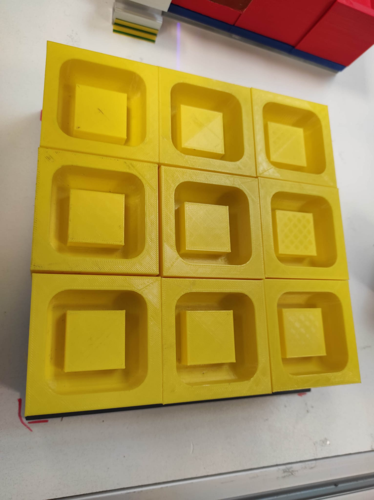
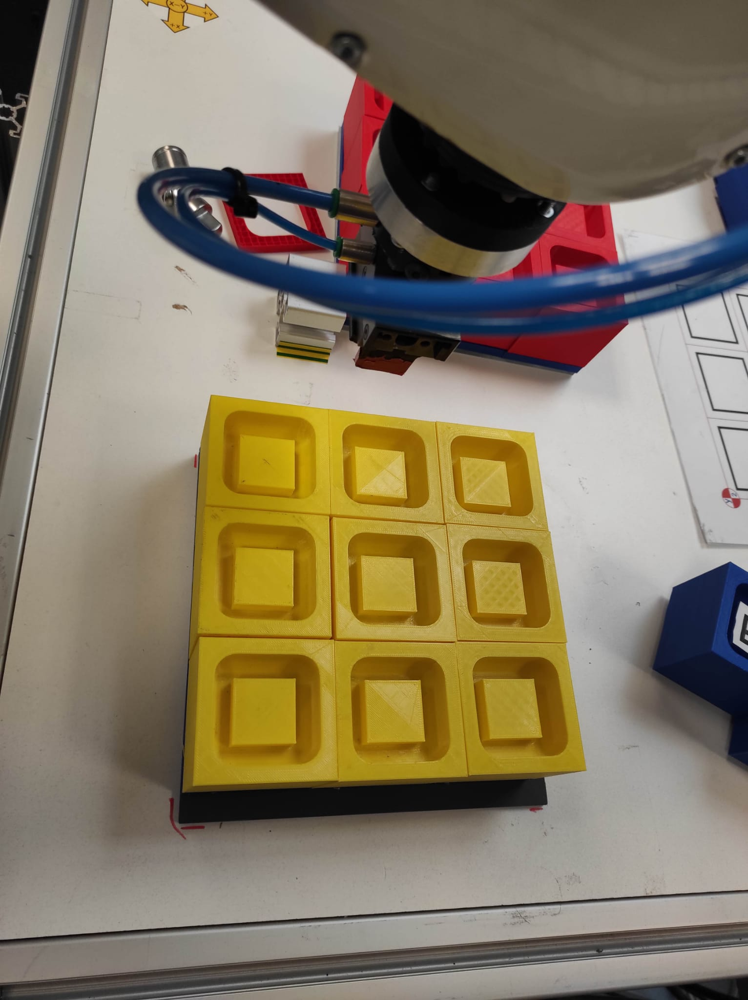

## Introduction


## Materiels
Les materiels à votre disposition sont:
- robot kuka R650 avec une pince
- kit vision composé d'une realsense D435i 
- PC vision où seront lancer les noeuds de camera realsense
- PC fixe pour la programmeation en python sous vscode
- les cubes de differentes couleurs: jaune, vert, bleu et rouge
- les Palettes A, B et C

## Logiciel
Le robot communique avec le PC fixe en liaison serie. Un environnement ROS2 est concu pour la programmation du robot en python avec un environnement virtuel
Dans l'espace de travail de ROS2 est doté des noeuds:
- ros2_aruco : permet de lancer noeud de lecture d'aruco code
- ros2_interfaces: contenant les interfaces message
- service: permet de lancer un service de detection de couleur à partir de l'id de l'aruco_code
- robot: contient l'excutable de la base de données et le programme robot.
  
## Configuration
Ouvrir trois terminaux:
- terminal 1
```python
cd ~/Ros_ws
```
Activation de l'environnement virtuel 
```python
source ./venv/bin/activate
```
En sortie vous aurez:
```python
(venv) robot@PC-41496:~/Ros_ws$ 
```
Sourcer votre environnement:
```python
source install/setup.bash
```
Lancement du noeud service qui permet de determiner la couleur d'une piece:
service serveur 
```python
ros2 launch service add_color_check.launch.py 
```

- terminal 2
  Faire les memes procedures
service client
```python
ros2 run service service_client
```
- terminal 3
Lancer le noeud aruco
```python
ros2 launch ros2_aruco aruco_recognition.launch.py 
```
terminal vscode
colcon build --packages-select robot
terminal 1 
(venv) robot@PC-41496:~/Ros_ws$ 
. install/setup.bash
ros2 run service db.py

terminal 2
Passer en mode adm su
(venv) root@PC-41496:/home/robot/Ros_ws#
. install/setup.bash
ros2 run robot kuka.py 

Les packages

ros2_aruco 
ros2_interfaces
service
robot


## Travail à faire

scenarios 
Soint les points Pi(0<i<N) de la Pallette, P0 le point de depart, pPrise position de prise, pPose la position de depose, pAvant,pApres les position respectivment 
avant et apres la prise de piece sur le convoyeurs, pa les positions d'approche, px les positions de depose de pieces sur la palette,
soient Dx,DY et DZ la distances entre les positions suivant respectivement les axes x,y et z

1. Apprendre des points Pi(0<i<N) des Pallettes A, B, C .
  Ecrire un programme correspondant au robot de prendre les pieces sur le convoyeur et les poser sur les pallette A
Deduire l'algorithme qui permet de faire la meme operation connaissant les points seulement les positions P0 et P1


  

   
3. Ecrire le programme correspondant au robot de prendre les pieces sur le convoyeur et les poser sur la pallette sur deux niveaux
 Deduire l'algorithme qui permet de faire la meme operation connaissant les points seulement les positions P0 et P1

5.  Ecrire le programme correspondant au robot de prendre les pieces sur le convoyeur et les poser sur la pallette sur deux niveaux
 Deduire l'algorithme qui permet de faire la meme operation connaissant les points seulement les positions P0 et P1

7.  Deduire l'algorithme qui permet de faire la meme operation  connaissant les points seulement les positions P0 et P1 et les dimentions de la pallette NxMxH
8.  Les pieces arrivent sur le convoyeur, On souhaite disposer les pieces sur la palette A selon les couleurs et chaque niveau corrrespont à une couleur bien precise:
Jaune-vert-bleu
Bleu-Jaune-vert
Vert-bleu-jaune 
Pour ce faire, on dispose d'une base de données database.db. Lorsque la piece arrive au Point de Prise, la camera scanne l'arucode pour determiner son ID et sa couleur qui sont enregister sont publiés comme de topic ROS2. Le PC s'abonne au topic couleur et l'enregistre dans la base de données. Vous utilierez la database.db pour construire vos scénarios
A chaque fois que le robot prenne une piece de couleur differente, il le depose sur une autre palette.  
    
    
