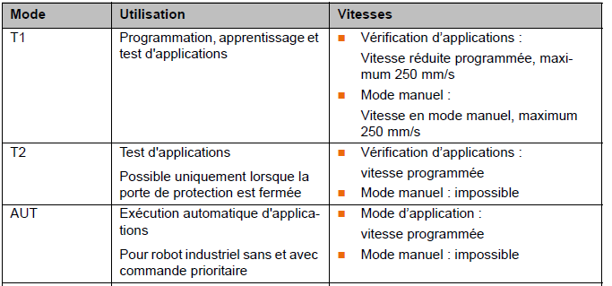
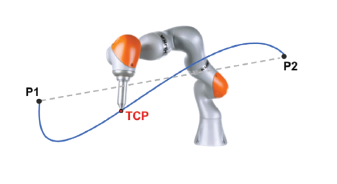
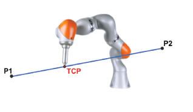
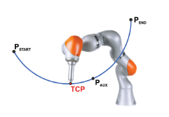
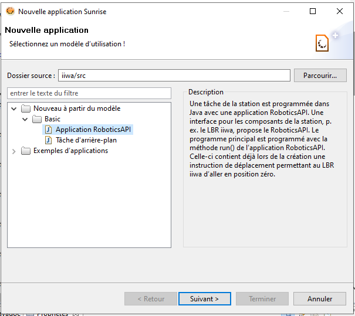
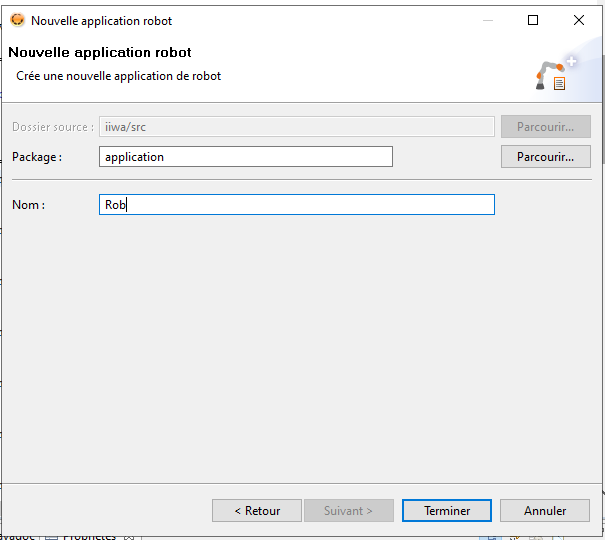

# Présentation
Kuka iiwa 14 R820 est un robot à sept (7) degré de liberté. Il est constitué des parties suivantes : 
Base, Epaule, Coude, poignet 1, Poignet 2 et Poignet 3, R redondant.
Kuka iiwa est un robot collaboratif avec une charge utile de 14 kg
  

# Mode de fonctionnement 



# Les types de mouvement 

Il existe plusieurs types de déplacement :
- Mouvement point à point (PTP): Le robot guide le point central de l'outil (TCP) le long du chemin le plus rapide jusqu'au point final. Le chemin le plus rapide n'est généralement pas le chemin le plus court dans l'espace et n'est pas toujours une ligne droite. Comme les mouvements des axes du robot sont simultanés et rationnels, les trajectoires courbes peuvent être exécutées plus rapidement que les trajectoires droites.
  
  
  
PTP est un mouvement de positionnement rapide. La trajectoire exacte du mouvement n'est pas prévisible ou contrôlée par le programmeur mais est toujours la même si les conditions générales n'ont pas changé.

- Mouvement linéaire (LIN) : Le robot guide le TCP à la vitesse définie le long d'une trajectoire rectiligne dans l'espace jusqu'au point final.
  
  

-	Mouvement circulaire (CIRC): Le robot guide le TCP à la vitesse définie le long d'une trajectoire circulaire jusqu'au point final
 

# Prise en main
Creation de nouvelle application: 
Aller dans Fichier-> Nouveau-> Application SunRise: 

 

 
 Selectionnez Application RoboticsAPI et clicker sur ``Suivant``
 Remplacer RobotApplication par le nom de votre application: RobVis_<nom_de_votre_groupe> par exemple RobVis_3
 
 

 
 Clicker sur ``Terminer`` pour créer votre application 
 Dans le fichier 

```java
Package application;


import javax.inject.Inject;
import com.kuka.roboticsAPI.applicationModel.RoboticsAPIApplication;
import static com.kuka.roboticsAPI.motionModel.BasicMotions.*;
import com.kuka.roboticsAPI.deviceModel.LBR;

/**
 * Implementation of a robot application.
 * <p>
 * The application provides a {@link RoboticsAPITask#initialize()} and a 
 * {@link RoboticsAPITask#run()} method, which will be called successively in 
 * the application lifecycle. The application will terminate automatically after 
 * the {@link RoboticsAPITask#run()} method has finished or after stopping the 
 * task. The {@link RoboticsAPITask#dispose()} method will be called, even if an 
 * exception is thrown during initialization or run. 
 * <p>
 * <b>It is imperative to call <code>super.dispose()</code> when overriding the 
 * {@link RoboticsAPITask#dispose()} method.</b> 
 * 
 * @see UseRoboticsAPIContext
 * @see #initialize()
 * @see #run()
 * @see #dispose()
 */
public class test extends RoboticsAPIApplication {
	@Inject
	private LBR lBR_iiwa_14_R820_1;

	@Override
	public void initialize() {
		// initialize your application here
	}

	@Override
	public void run() {
		// your application execution starts here
		lBR_iiwa_14_R820_1.move(ptpHome());
	}
}
```


# Application
Soit une plaque, R1 une base associée à cette plaque. Soit R0, le repère lié au robot.  
Les Pi les points de la plaque. 
1.	Ecrire un programme workbench pour prendre les pièces de la plaque dans les Pi connus et l’empiler dans une position de « depose » 

2.	Ecrire un programme workbench pour chercher et prendre une pièce de plaque dans les Pi connus et la dépose dans une position de « dépose ».

Sachant les dimensions de la plaque DX, DY, écrire :
3.	Un algorithme de localisation de la pièce dans la zone définie par la plaque   
4.	Un algorithme de localisation du centre de la pièce 
5.	Déduire un programme workbench pour chercher et prendre une pièce de plaque dans les Pi non connus et la dépose dans une position de « dépose ». 

On considère que les pièces sont très fragiles. 
6.	Un programme workbench pour chercher et prendre une pièce de plaque dans les Pi non connus et la dépose dans une position de « dépose ». 

``` java

public class TP3 extends RoboticsAPIApplication {
	@Inject
	private LBR lBR_iiwa_14_R820_1;
	@Inject
	private SortieIOGroup Sortie;
	
	private Tool pince;
	
	private Workpiece cylindre;
	
	private CartesianImpedanceControlMode compliant;
	private CartesianSineImpedanceControlMode vibra;
	private Boolean s;
	private ForceCondition contactForceReached;
	
    boolean touche;
    double dx;
    double dy;
    double dz;
    double z_init;
    int i;
    int j;
    double z_limit;
    
	
	@Override
	public void initialize() {
		// initialize your application here
		pince = getApplicationData().createFromTemplate("Prehenseur");
		pince.attachTo(lBR_iiwa_14_R820_1.getFlange());
		contactForceReached = ForceCondition.createSpatialForceCondition(lBR_iiwa_14_R820_1.getFlange(), 8.0);
				
		// Workpiece init 
		cylindre = getApplicationData().createFromTemplate("cylindre");
		
		//processdata = getApplicationData().getProcessData("isTrue").getValue();
		compliant = new CartesianImpedanceControlMode();
		compliant.parametrize(CartDOF.Z).setStiffness(50);
	}

	@Override
	public void run() {
		// your application execution starts here
		pince.move(ptp(getApplicationData().getFrame("/Start")).setJointVelocityRel(0.5));
	
	}
	
	
	private void move(double dx, double dy){
		pince.move(linRel(-dx,-dy,0.0,getApplicationData().getFrame("/base")).setJointVelocityRel(0.3));
		ThreadUtil.milliSleep(1500);
	}
	
	private void depose(){
		Sortie.setSortie1(false);
		ThreadUtil.milliSleep(1500);
		
	}
	private void prise(){
		Sortie.setSortie1(true);
		ThreadUtil.milliSleep(500);
	}
	public boolean find() {
		boolean f;
		//ThreadUtil.milliSleep(1500);
		pince.move(linRel(0,0,400.0,getApplicationData().getFrame("/Prise/P1")).setJointVelocityRel(0.1).breakWhen(contactForceReached));
		
		if (getZ()<z_limit-150){
			f=false;
		}
		else {
			f=true;
		}
		return f;
	}
		
	
	
	public double getZ() {
		double sol;
		sol = lBR_iiwa_14_R820_1.getCurrentCartesianPosition(pince.getDefaultMotionFrame()).getZ();
		return sol;	
	}
}

```
