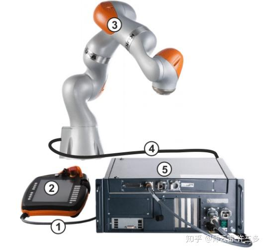

# Présentation
Kuka iiwa 14 R820 est un robot à sept (7) degré de liberté. Il est constitué des parties suivantes : 
Base, Epaule, Coude, poignet 1, Poignet 2 et Poignet 3, R redondant.
Kuka iiwa est un robot collaboratif avec une charge utile de 14 kg
  

# Mode de fonctionnement 

# Les types de mouvement 

Il existe plusieurs types de déplacement :
- Mouvement point à point (PTP): Le robot guide le point central de l'outil (TCP) le long du chemin le plus rapide jusqu'au point final. Le chemin le plus rapide n'est généralement pas le chemin le plus court dans l'espace et n'est pas toujours une ligne droite. Comme les mouvements des axes du robot sont simultanés et rationnels, les trajectoires courbes peuvent être exécutées plus rapidement que les trajectoires droites.
  
  
  
PTP est un mouvement de positionnement rapide. La trajectoire exacte du mouvement n'est pas prévisible ou contrôlée par le programmeur mais est toujours la même si les conditions générales n'ont pas changé.

- Mouvement linéaire (LIN) : Le robot guide le TCP à la vitesse définie le long d'une trajectoire rectiligne dans l'espace jusqu'au point final.
  
  

-	Mouvement circulaire (CIRC): Le robot guide le TCP à la vitesse définie le long d'une trajectoire circulaire jusqu'au point final
 
